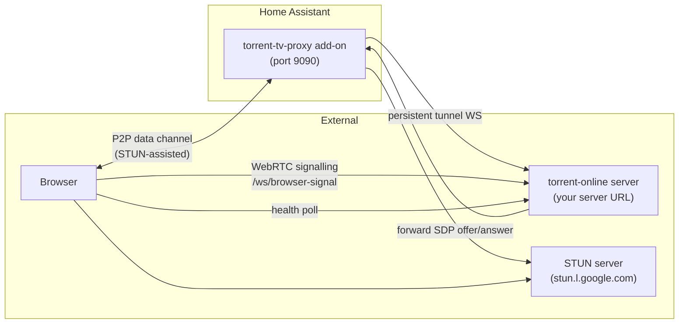

# Torrent TV Proxy — Home Assistant Add-on

Installs and runs `@torrent-tv/proxy` as a Home Assistant add-on. No manual setup required.

[](https://my.home-assistant.io/redirect/supervisor_add_addon_repository/?repository_url=https%3A%2F%2Fgithub.com%2Ftorrent-tv%2Fha-addon)

## What it does

The proxy add-on connects to a running `torrent-online` server and exposes torrent content over HTTP and WebRTC. It:

- Registers itself with the registry server so the browser can discover it.
- Maintains a persistent WebSocket tunnel to the server for health reporting and WebRTC signalling.
- Accepts P2P WebRTC data channel connections from browsers (STUN-assisted NAT traversal).
- Streams torrent files directly to the browser over the data channel.
- Transcodes audio (or video+audio) to HLS with ffmpeg for browser codec compatibility.



## Installation

### From repository URL

1. Open Home Assistant → **Settings → Add-ons → Add-on Store**.
2. Click the three-dot menu → **Repositories**.
3. Paste: `https://github.com/torrent-tv/ha-addon`
4. Click **Add**, then find **Torrent TV Proxy** in the store and click **Install**.

Or use the My Home Assistant link above.

## Configuration

| Option | Required | Description |
|--------|----------|-------------|
| `server_url` | **Yes** | Base URL of the `torrent-online` server, e.g. `http://192.168.1.10:8080` |
| `public_base_url` | No | Externally reachable URL of this add-on, if different from the auto-detected one |
| `token` | No | Auth token matching the `--token` option on the server |

### Setting options

1. Open the **Torrent TV Proxy** add-on → **Configuration** tab.
2. Set `server_url` to your server's address.
3. Click **Save**.

## Starting the add-on

1. Open the **Info** tab.
2. Click **Start**.
3. Optionally enable **Start on boot** and **Watchdog**.
4. Check the **Log** tab for startup status.

The proxy binds to port `9090/tcp` and registers itself with the server automatically.

## Repository structure

```text
ha-addon/
  repository.yaml          HA add-on repository descriptor
  torrent_tv_proxy/
    config.yaml            Add-on metadata (name, slug, arch, ports, schema)
    Dockerfile             Based on Alpine; installs Node.js + npm package
    run.sh                 Reads options via bashio and starts the proxy
```

## Supported architectures

`aarch64`, `amd64`, `armhf`, `armv7`, `i386`
